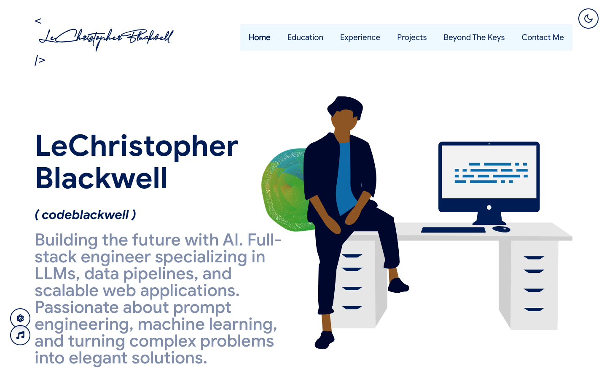
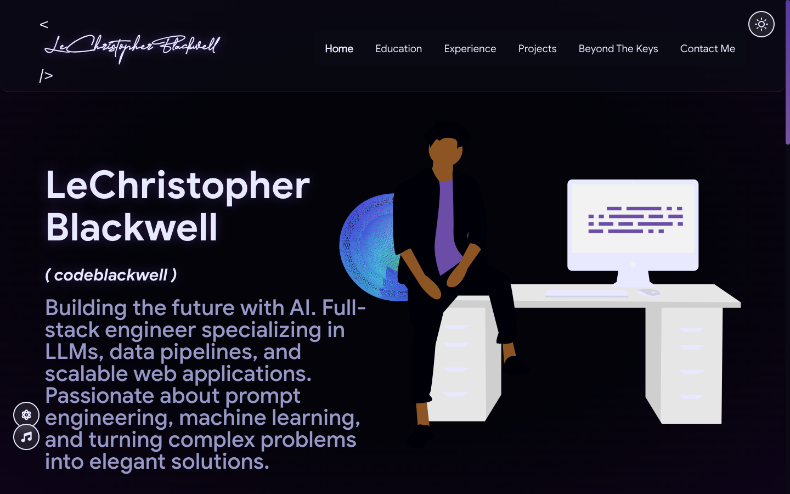
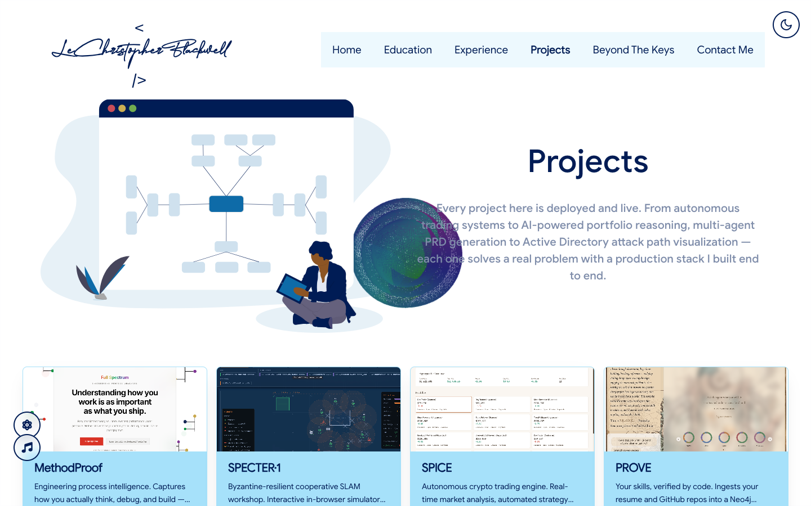
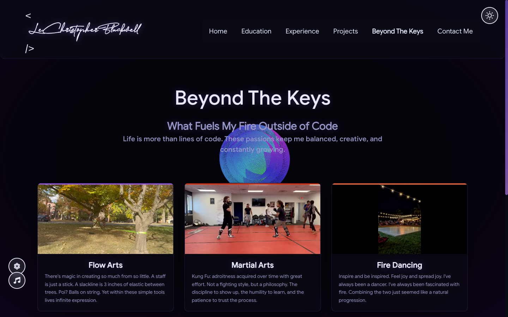

<p align="center">
  <a href="https://codeblackwell.ai" target="_blank">
    </img>
  </a>
</p>

<h1 align="center">codeblackwell.ai</h1>
<h3 align="center">The personal portfolio of LeChristopher Blackwell, Full Stack Engineer & AI Specialist</h3>

<p align="center">
  <a href="https://reactjs.org/"></a>
  <a href="https://nodejs.org/"></a>
  <a href="https://threejs.org/"></a>
  <a href="https://aws.amazon.com/cloudfront/"></a>
  <a href="./LICENSE"></a>
  <a href="https://codeblackwell.ai"></a>
</p>

<p align="center"><b>Live at <a href="https://codeblackwell.ai">codeblackwell.ai</a></b></p>

This is a heavily refactored fork of [masterPortfolio](https://github.com/ashutosh1919/masterPortfolio). The content system, theming, and configuration model come from that template; almost everything else has been rebuilt. The site now ships an audio reactive WebGL background, a background music player, a video driven personal passions page, an interactive workshop, a custom deep space dark theme, and a dual GitHub Pages + CloudFront CDN deploy pipeline.

## What is different from the original

| Area           | This portfolio                                                                                                                                 |
| -------------- | ---------------------------------------------------------------------------------------------------------------------------------------------- |
| **Background** | Audio reactive WebGL visualizer (`three.js` / `@react-three/fiber`) that pulses to the music, with two modes (Nebula, Terrain) that auto cycle |
| **Sound**      | Built in background music player wired to a real audio analyser; the visualizer reads its live frequency data                                  |
| **Theme**      | Blue light theme + a bespoke `materialDark` deep space purple theme. 14 color themes ship in `theme.js`                                        |
| **New pages**  | "Beyond The Keys" (video passions), "The Workshop", "Projects"                                                                                 |
| **Hosting**    | GitHub Pages **and** AWS CloudFront + S3 with Lambda@Edge OpenGraph tags, all in `infrastructure/` (CloudFormation)                            |
| **CI/CD**      | Push to `master` triggers GitHub Actions: build, publish to `gh-pages`, sync to S3, invalidate the CDN                                         |

<p align="center">
  
  
</p>
<p align="center">
  
</p>

## Sections

- Home with animated signature splash logo
- Skills
- Open source work pulled live from GitHub
- Experience
- Education and certifications
- Projects
- Beyond The Keys (personal passions, video backed)
- The Workshop
- Contact

# Table of Contents

- [Run it locally](#run-it-locally)
- [Customize the content](#customize-the-content)
- [Customize the look](#customize-the-look)
- [Audio visualizer and music](#audio-visualizer-and-music)
- [GitHub data](#github-data)
- [Deployment](#deployment)
- [Tech stack](#tech-stack)
- [License](#license)
- [Credit](#credit)

# Run it locally

Built on React (Create React App), so you need `node` and `npm` (Node 20 recommended).

```bash
git clone https://github.com/CodeBlackwell/codeblackwell.github.io.git
cd codeblackwell.github.io
npm install
npm start            # or: just dev
```

The dev server runs with `--openssl-legacy-provider` (already wired into the npm scripts). The repo also has a `Justfile`, so `just` lists every task.

# Customize the content

Almost all text, links, and section data live in one file: **`src/portfolio.js`**.

```javascript
const settings = { isSplash: true };   // false skips the animated logo intro

const seo = { ... };                   // page title, meta description, OpenGraph
const greeting = { ... };              // name, tagline, resume link, GitHub handle
const socialMediaLinks = [ ... ];      // GitHub, LinkedIn, X, email
const skills = { ... };                // skill groups + icons
const degrees / certifications;        // education page
const experience = { ... };            // jobs, internships
const projectsHeader / publications;   // projects page cards
const workshopData = { ... };          // The Workshop page
const beyondPageData = { ... };        // Beyond The Keys passions
const contactPageData = { ... };       // contact + blog cards
```

Edit those objects and the site updates. A few specifics:

**Skill icons** use [Iconify](https://icon-sets.iconify.design/) class names in `fontAwesomeClassname`. To use a custom image instead, drop it in `public/skills/` and set `imageSrc` on that skill (it takes precedence over the icon class).

**Resume** is `public/LeChristopher_Blackwell_Resume.pdf`, referenced by `greeting.resumeLink`. Replace the file and update the link.

**Beyond The Keys passions** each take an image, a video, an accent color, and optional social links:

```javascript
passions: [
  {
    id: "flow-arts",
    name: "Flow Arts",
    description: "...",
    image_path: "passions/flow-arts.jpg",   // poster frame
    video_path: "passions/flow-arts.mp4",    // hover/play video
    color_code: "#9b5de5",                    // card accent
  },
  ...
]
```

Media lives in `public/passions/` as matching `.jpg` + `.mp4` pairs.

**Favicons, manifest, OpenGraph image, sitemap** live in `public/icons/`, `public/og/`, and `public/manifest.json`. Replace `public/og/default.png` (1200x630) for the social card.

# Customize the look

Themes are defined in **`src/theme.js`** (14 of them). The active pair is chosen in **`src/App.js`**:

```javascript
const currentTheme = isDarkMode ? materialDarkTheme : blueTheme;
```

Swap either side for any exported theme, or add your own. Each theme is a flat object of color tokens, plus a `visualizer` block that drives the WebGL background:

```javascript
export const blueTheme = {
  body: "#EDF9FE",
  text: "#001C55",
  highlight: "#A6E1FA",
  jacketColor: "#0A2472",
  splashBg: "#001C55",
  visualizer: {
    // colors the audio reactive background
    primary: "#0E6BA8",
    secondary: "#A6E1FA",
    accent: "#0A2472",
    glow: "#0E6BA8",
    opacity: 0.7,
  },
};
```

The dark theme (`materialDarkTheme`) adds `isDeepSpace: true` and a `glass` block for the frosted glass UI. Dark mode is toggled top right and persists to `localStorage`.

# Audio visualizer and music

The background is a live `three.js` scene reacting to the music track.

- **Track:** set `AUDIO_FILE` in `src/components/musicPlayer/MusicPlayer.js`. The current file is `public/audio/Khruangbin - People Everywhere (Still Alive).mp3`. Replace the mp3 and update that constant.
- **Visualizer modes:** defined in `src/components/audioVisualizer/visualizerModes.js` (`Nebula`, `Terrain`). They auto cycle every 24s and can be advanced manually with the mode button (bottom left). Tune `AUTO_CYCLE_INTERVAL`, `TRANSITION_DURATION`, and the `MODE_ORDER` array there.
- **Colors:** come from the active theme's `visualizer` block (see above), so the background recolors with the theme.
- **Plumbing:** `useAudioAnalyser` (Web Audio API) feeds live frequency data to the canvas; `useVisualizerMode` handles cycling. Both are in `src/hooks/`.

# GitHub data

Open source cards are fetched from the GitHub API, not hardcoded.

1. Copy `env.example` to `.env` and fill in:
   ```
   GITHUB_TOKEN=your_personal_access_token
   GITHUB_USERNAME=your_username
   ```
2. Run the fetcher:
   ```bash
   node git_data_fetcher.mjs    # or: just fetch-github
   ```

This writes JSON into `src/shared/opensource/` (pull requests, issues, organizations, pinned projects). Re run it whenever you want to refresh. Treat the token like a password; keep it in `.env` only.

# Deployment

The domain `codeblackwell.ai` is served two ways, both fired by a single push.

```bash
just deploy        # git push origin master
# or: just ship "your commit message"
```

Pushing to `master` runs `.github/workflows/deploy.yml`, which:

1. Builds the production bundle.
2. Publishes it to the `gh-pages` branch with the `codeblackwell.ai` CNAME (GitHub Pages).
3. Syncs `build/` to the S3 bucket and invalidates the CloudFront distribution (AWS CDN).

The CDN stack (S3, CloudFront, ACM, Route 53, and a Lambda@Edge function that injects per route OpenGraph tags) is CloudFormation in `infrastructure/`. Manage it with the `just cdn-*` and `just infra-*` recipes. See `infrastructure/README.md` for the full stack.

To reuse this for your own `username.github.io`: point `CNAME` and the `homepage` field at your domain, update the AWS resource names in `infrastructure/cloudformation.yml` (or drop the CDN steps from the workflow and run pure GitHub Pages).

# Tech stack

- [React 16](https://reactjs.org/) (Create React App)
- [three.js](https://threejs.org/) + [@react-three/fiber](https://github.com/pmndrs/react-three-fiber) for the visualizer
- [styled-components](https://styled-components.com/) for theming
- [Apollo / GraphQL](https://www.apollographql.com/) for GitHub data
- [react-router v5](https://reactrouter.com/), [react-reveal](https://www.react-reveal.com/) for routing and animation
- Web Audio API for the analyser
- AWS CloudFront + S3 + Lambda@Edge, GitHub Actions, GitHub Pages

Illustrations from [unDraw](https://undraw.co/illustrations).

# License

MIT. See [LICENSE](./LICENSE).

# Credit

This project is forked from and builds on [**masterPortfolio** by Ashutosh Hathidara](https://github.com/ashutosh1919/masterPortfolio) (MIT). The original supplied the configuration driven content model, the theming structure, and the page scaffolding. The audio visualizer, music player, Beyond The Keys and Workshop pages, deep space theme, AWS CDN infrastructure, and CI/CD pipeline are additions in this fork. masterPortfolio itself draws design ideas from [Saad Pasta's developerFolio](https://github.com/saadpasta/developerFolio).
